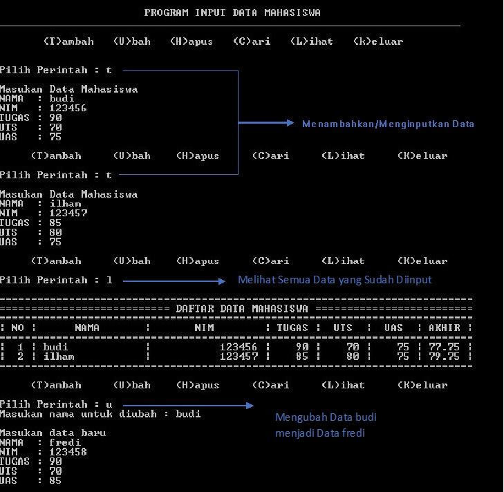
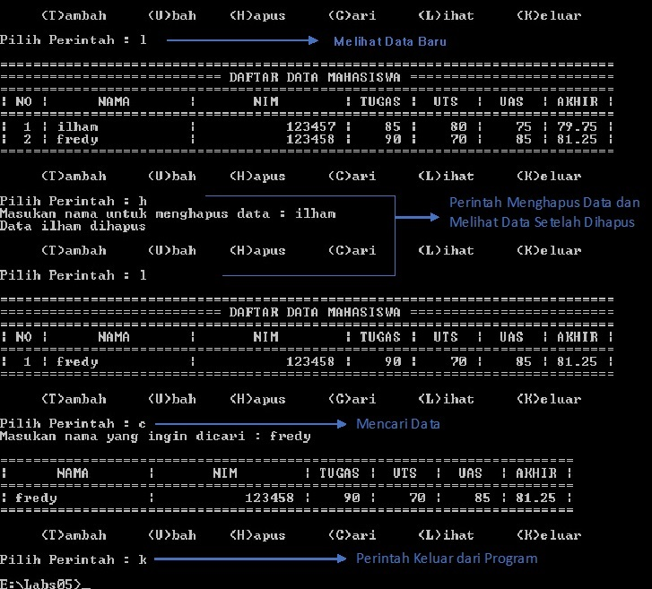

# 
--Penjelasan Tugas 5--

1.Deklarasi dictionary data 
2.Input untuk pilih opsi  
<strong>(T)ambah       (U)bah      (H)apus     (C)ari      (L)ihat     (K)eluar</strong>   
3.Jika Input T
* 3.1 Input nama, nim, tugas, uts, uas
* 3.2 Nilai akhir perpaduan nilai tugas, uts, uas
* 3.3 Jika nilai nim, tugas, uts, uas, kosong/tidak di isi dengan angka maka ValueError dan meminta input ulang
* 3.4 semua data akan di tambahkan menjadi value dan key menggunakan nama
	
4.Jika Input U		
* 4.1 Input nama/key yg di cari
* 4.2 Jika nama ada di data.keys
	* 4.2.1 Input pembaruan data
	* 4.2.2 Jika nilai nim, tugas, uts, uas kosong/tidak di isi dengan angka maka ValueError dan meminta input ulang
	* 4.2.3 Input akan menimpa data yang lama
* 4.3 Jika tidak
	* 4.3.1 Data tidak di temukan
		
5.Jika Input H
* 5.1 Input nama/key yg di cari
* 5.2 Jika nama ada di data.keys
	* 5.2.1 Maka datanya akan di hapus
* 5.3 Jika tidak
	* 5.3.1 Data tidak di temukan
		
6.Jika Input C
* 6.1 Input nama/key yg di cari
* 6.2 Jika nama ada di data.keys
	* 6.2.1 Print nama, nim, uts, tugas,akhir
* 6.3
	* 6.3.1 Data tidak di temukan

7.Jika Input L
* 7.1 Print data.values / memanggil semua values
	
8.Jika Input K
* 8.1 Program Berhenti

9.Jika Input diluar, T, U, H, C, L, K
* 9.1 Perintah Tidak Tersedia

<strong>
Hasil Program
</strong>

